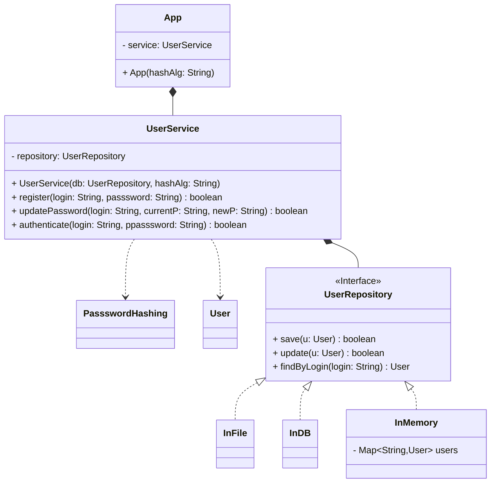

```mermaid

classDiagram
direction TB
    class PassswordHashing
    class App{
        - service: UserService
        + App(hashAlg: String)
    }
    class User
    class UserService{
        - repository: UserRepository
        + UserService(db: UserRepository, hashAlg: String)
        + register(login: String, passsword: String) boolean
        + updatePassword(login: String, currentP: String, newP: String) boolean
        + authenticate (login: String, ppasssword: String) boolean
    }
    class UserRepository{
        <<Interface>>
        + save(u: User) boolean
        + update(u: User) boolean
        + findByLogin( login: String) User
    }
    class InMemory{
        - Map~String,User~ users
    }
    
    UserRepository <|.. InFile
    UserRepository <|.. InDB
    UserRepository <|.. InMemory
    App *-- UserService
    UserService ..> User
    UserService *-- UserRepository
    UserService ..> PassswordHashing
```